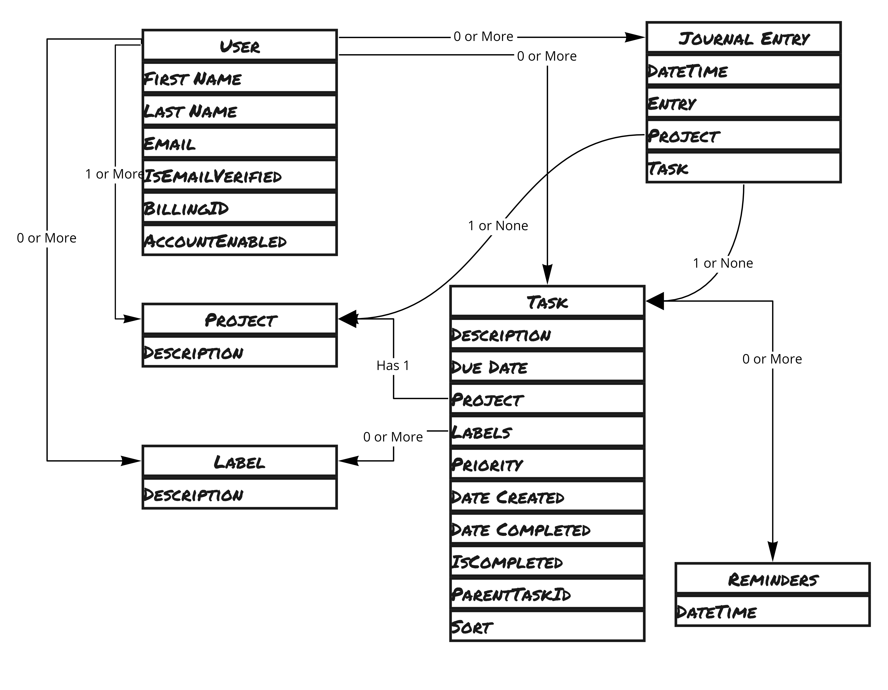
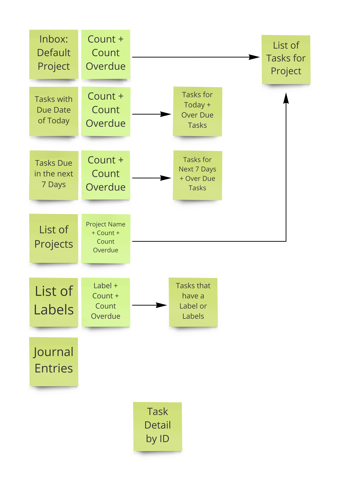
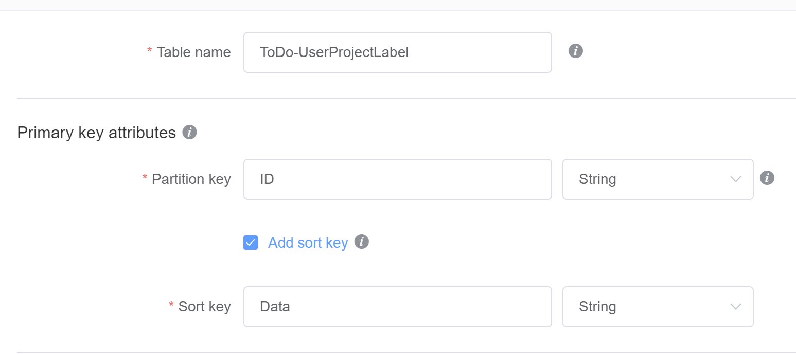
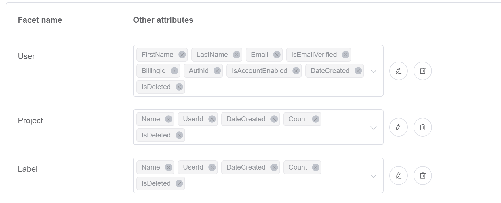
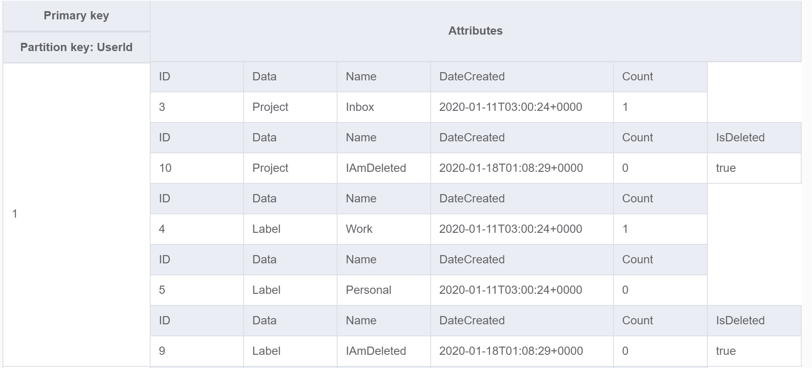

## TLDR;
Just run the shell script labaled: createDynamoDbSchema.sh
**BE SURE TO MODIFY IT TO POINT TO YOUR DESIRED REGION!!!**

## Dynamo DB Modeling ToDo.json

I used the new ( at the time of this writing ) NoSql Workbench for Dynamo DB to experiment and iterate until I got a table structure I was happy with.  
Find it [here](https://docs.aws.amazon.com/amazondynamodb/latest/developerguide/workbench.html)

## Create the Table Schema Required for the CLI
I am not complete sure why they decided to make the Json schema that is created by Json Workbench so different from the JSON that the CreateTable CLI requires, but they did.  

* ToDo-UserProjectLabel.json
* ToDo-Task.json
* ToDo-Task-Old.json
* ToDo-Journal.json

## I started with an ERD

## Think about the Access Patterns

## What I came up with

### ToDo-UserProjectLabel
This table will rarely change - but it will be read a lot in order to paint the main page.  Because this access pattern is different from the other objects, they are segregated into this table.  

The partition key will just be Guids so that entries are distributed accross the key space.  

The Sort Key "Data" is hard coded to one of the following values:
1. User
2. Project
3. Label

#### Facets

Project and Label Records each have a UserId attribute so I can create a GSI on UserId that will give me a list of all Projects and Labels for a User.  

### ToDo-Task
This is the workhorse of the entire application.  Heavy Read and Write actiity.  

The first thing to realize about this table is that over time we will accumulate many tasks - in fact in a very short period of time the majority of the task objects will actually just be there for the purpose of record keeping or for reporting.  

What we want is to keep the application snappy and responsive and not slow down as it scales.  So we have 2 tables.  Task and Task-Old.  

As Tasks are added, deleted, or completed; if they belong to a Project or Task, then a lambda updates the corresponding totals:  Count and CountOverdue.

As tasks are completed or deleted - they make their way to the ToDo-Task-Old table via a lambda.  This table has much lower read and write levels saving  money.  

### ToDo-Task-Old

A lambda runs in the background moving records from the active table to the older table.  That table is rarely changed, and is often read in order to get aggregates - so it is created more for that reason.  
## ToDo-Journal

Here the Partition Key is the User Id and the Sort Key is the Date Created.  This should hold.  The only concern is that if this partition ever grows larger than 10 GB - then we will be exceeding the max capable limits.  

In an effor to keep thing small.  I just keep a snippet of the entry to show right away in the UI - but when they click on it I can get the entire entry from S3.  
