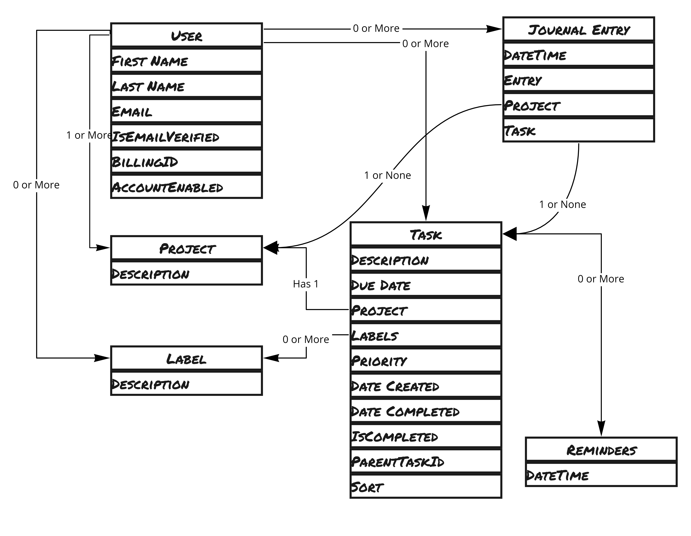
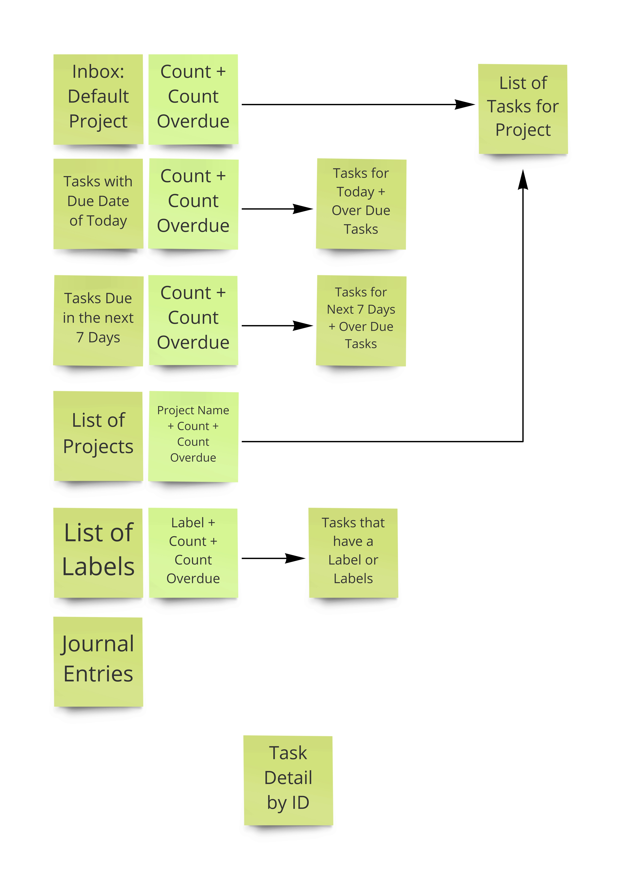
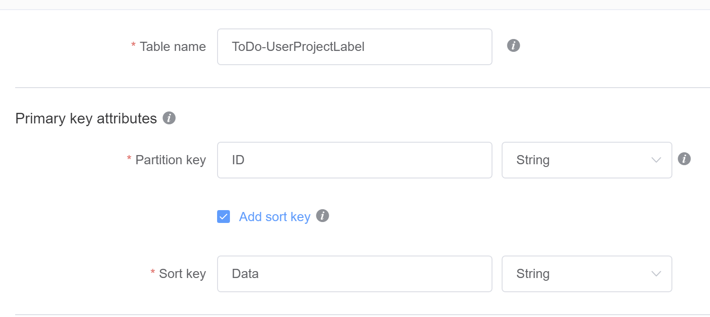
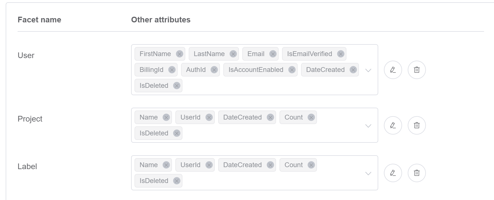
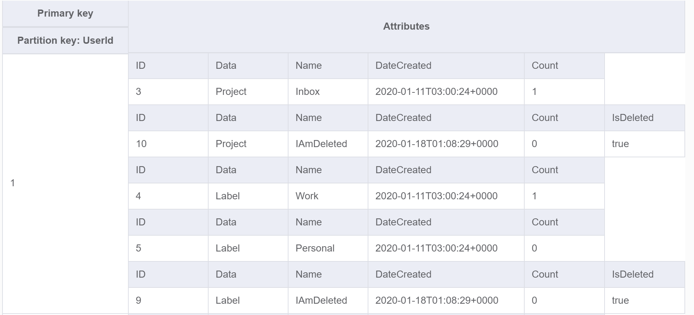

## TLDR;
Just run the shell script labaled: createDynamoDbSchema.sh.
**BE SURE TO MODIFY IT TO POINT TO YOUR DESIRED REGION!!!**

## Dynamo DB Modeling ToDo.json

I used the new ( at the time of this writing ) NoSql Workbench for Dynamo DB to experiment and iterate until I got a table structure I was happy with.  
Find it [here](https://docs.aws.amazon.com/amazondynamodb/latest/developerguide/workbench.html)

## Create the Table Schema Required for the CLI
I am not complete sure why they decided to make the Json schema that is created by Json Workbench so different from the JSON that the CreateTable CLI requires, but they did.  

* ToDo-UserProjectLabel.json
* ToDo-Task.json
* ToDo-Task-Old.json
* ToDo-Journal.json

## I started with an ERD

## Think about the Access Patterns

## What I came up with

### ToDo-UserProjectLabel
This table will rarely change - but it will be read a lot in order to paint the main page.  Because this access pattern is different from the other objects, they are segregated into this table.  

The partition key will just be Guids so that entries are distributed accross the key space.  

The Sort Key "Data" is hard coded to one of the following values:
1. User
2. Project
3. Label

#### Facets

Project and Label Records each have a UserId attribute so I can create a GSI on UserId that will give me a list of all Projects and Labels for a User.  

### ToDo-Task
This is the workhorse of the entire application.  Heavy Read and Write actiity.  

The first thing to realize about this table is that over time we will accumulate many tasks - in fact in a very short period of time the majority of the task objects will actually just be there for the purpose of record keeping or for reporting.  

What we want is to keep the application snappy and responsive and not slow down as it scales.  So we have 2 tables.  Task and Task-Old.  

As tasks are completed or deleted - they make their way to the -Old table.  This table has much lower read and write levels saving us valuable money.  

To make queries deciding what needs to go to the old table there is a really cool trick Dynamo DB has.  Use an attribute for a row on a global secondary index.  If the row does not have that attribute it is not part of the index.  

Since there are three categories of tasks I use this tecnique to make it easy to find thigs that need to move. 

1. Current
2. Completed - Not Current
3. Delete - Who cares?

Inside the application logic ( that has yet to be written ) I will add the attribute IsCurrent ( does not matter the value ) for what I need to pull down as the active set.  These are tasks that are not done and are not delted.    

Whenever a task is completed I remove the IsCurrent Attribute - which makes my index super small and fixed on what is active.  And add the attribute IsNotCurrent.  

Whenever a task is deleted - I remove the Current Attribute and add a IsDeleted Attribute.  

Then I have indexes that I use periodically to select records from the primary table to move to the Old table.  

### ToDo-Task-Old

A lambda runs in the background moving records from the active table to the older table.  That table is rarely changed, and is often read in order to get aggregates - so it is created more for that reason.  
## ToDo-Journal

Here the Partition Key is the User Id and the Sort Key is the Date Created.  This should hold.  The only concern is that if this partition ever grows larger than 10 GB - then we will be exceeding the max capable limits.  

In an effor to keep thing small.  I just keep a snippet of the entry to show right away in the UI - but when they click on it I can get the entire entry from S3.  
