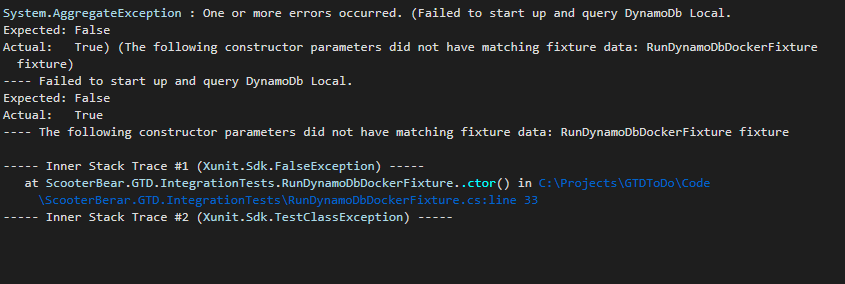

# Getting Things Done - To Do Application
Getting Things Done app based on David Allen - using Dynamo Db 
If you have never heard of GTD - Do yourself a huge service and check out more [here](https://www.amazon.com/Getting-Things-Done-Stress-Free-Productivity/dp/0143126563/ref=sr_1_2?crid=1VE575S8WWMKQ&keywords=david+allen+getting+things+done&qid=1580194663&sprefix=David+Allen%2Caps%2C173&sr=8-2)

**__NOTE:  This is a rapidly written stream of conciousness completed at the time of writing the code. It is going to have erratum ( like a lot of it ).  It needs an editors love and care.  Focus on the message and not the medium and enjoy the ride.__**  

## Purpose
Showcase skils, play with new technology, memorialize biolerplate code for re use. 

## Theory / Ideas / Commentary

* [UI Design](./Design/README.md)
* [DynamoDb Design](./DynamoDbModeling/README.md)
* [Make Custom Dynamo DB Docker Image](./MakeDnaymoDbDockerImage/README.md)
* [Take me to the Code!!!](./Code/README.md)

## Want to run the code?  
### Developer Depenencies
* [Docker Desktop 2.1.0.5 (40693)](https://docs.docker.com/docker-for-windows/install/)
* [Dotnet Core 3.1.101](https://dotnet.microsoft.com/download/dotnet-core/3.1)
__NOTE: You must be using Visual Studio 2019 16.4.3 or above to work with Dotnet Core 3.1.__
* [AWS CLI v1](https://docs.aws.amazon.com/cli/latest/userguide/install-windows.html#install-msi-on-windows)
* [AWS SAM CLI](https://docs.aws.amazon.com/serverless-application-model/latest/developerguide/serverless-sam-cli-install-windows.html)
* An Administrator Local Account ( Docker needs this to mount drives. )
* If you are using Visual Studio - it must be v2019 16.4.3 or above to work with the Dotnet Core 3.1 bits. 

### Setup Docker Image
In order to run the tests you must build your docker image that has your base schema installed.  If you do not you will see something like this when running Integration Tests. 



To Fix, open up Gitbash here:  `GTDToDo\MakeDnaymoDbDockerImage`
> NOTE:  This step is going to require that you have a local admin account.  Docker does not like certain types of accounts when mounting volumes, for that reason we suggest just using a local admin account.  Open up Docker for Windows, Settings, and then unshare and reset credentials, and then share C drive only this time use your local admin account.  

> NOTE:  Be sure you have already run aws configure.  You should be able to list tables by running this command: `aws dynamodb list-tables`

Now run the command to bulid your docker image:  
```
./BuildCustomDyanmoDbDocker.sh
```